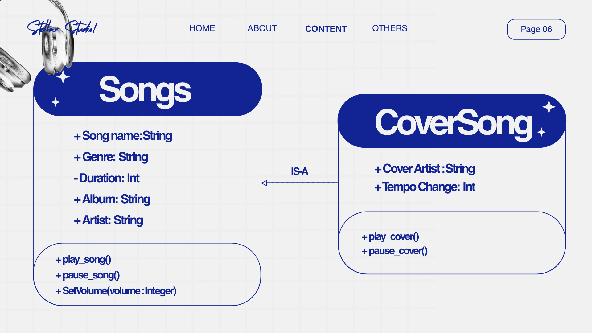
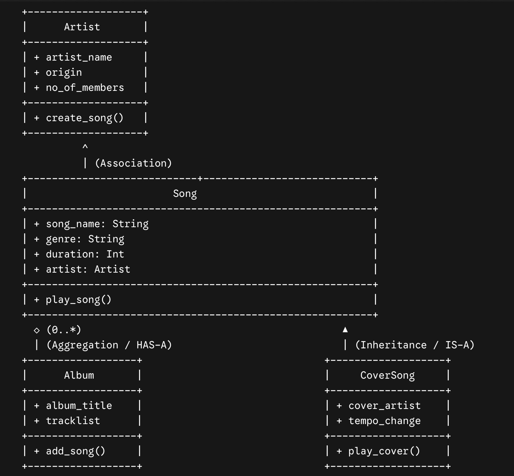
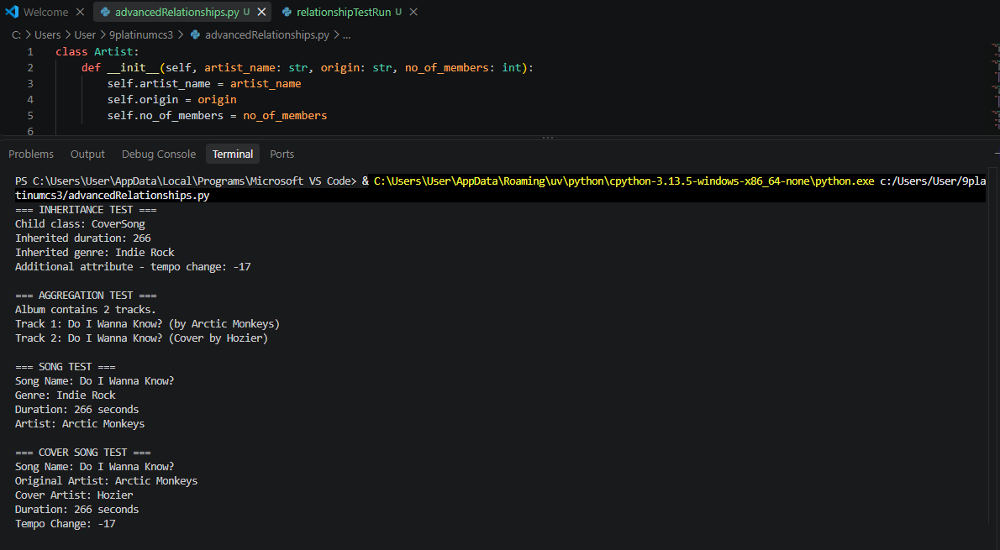
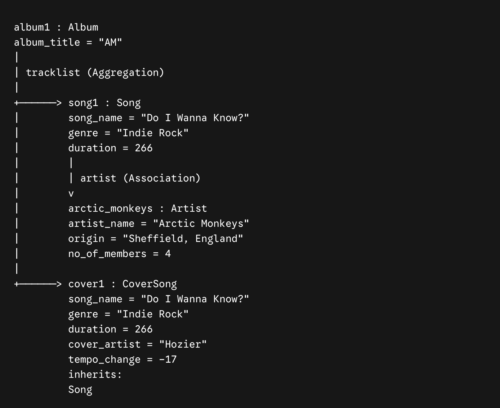

# Advanced Class Relationships
## Previous Activities
[classObj](classObjectUML.md)

[classAttrib](classAttributesMethods.md)

[classRel](classRelationships.md)

## Existing System Description:
The system models a music library ecosystem consisting of Song and Artist entities. It has been updated using Object-Oriented principles to handle specialized track types like cover songs, group tracks into albums, and simulate audio playback.

## Inheritance Relationship
Parent: Songs

Child: CoverSongs

Explanation: A CoverSong IS-A Song. It inherits core attributes like song_name, genre, duration, and artist from the Song class, while adding specialized attributes like cover_artist and tempo_change for modified track performances.

## Inheritance UML

## Composition/Aggregation
Relationship: Aggregation

Explanation: An Album HAS-A list of Song objects. This is an Aggregation relationship because individual songs can exist independently of the album. Deleting the album object from the system does not destroy the song instances themselves.

## Advanced UML Diagram

## Python Implementation
[Source Code](advancedRelationships.py)

## Test Run

## Object Diagram

## Reflection

## 1. Why did you choose your inheritance relationship? Explain why your child class is a type of your parent class.
I chose CoverSong as a child class of Song because a cover IS-A song at its core. Tracks like "Do I Wanna Know?" covered by Hozier share common song properties like song_name, genre, duration, and artist with the original version by Arctic Monkeys. The child class represents a specific type of song performance that adds unique attributes such as cover_artist and tempo_change.

## 2. How did inheritance reduce duplicate code? Identify attributes or methods that were reused.
Inheritance allowed RemixSong to reuse parent attributes (song_name, genre, duration, artist) and methods (play_song()) without re-declaring them. By calling super().__init__(), the child class leverages the base initialization logic directly, reducing structural redundancy across music tracks.

### 3. Why is your HAS-A relationship Composition or Aggregation? Explain the lifecycle relationship between the two objects.
My Album HAS-A Song relationship is Aggregation because Song objects exist independently of an Album. Deleting an album object from memory does not destroy individual song tracks. Standalone songs by Arctic Monkeys or Hozier remain intact in the system and can be added to playlists or released as singles.

### 4. What is the difference between Association from Part III and the advanced relationship you implemented?
Plain Association from Part III represented a generic connection where Song referenced Artist without defining lifecycle ownership. Aggregation adds explicit loose containment where Album stores Song references, while Inheritance establishes a strict type hierarchy where CoverSong reuses code directly from Song.

### 5. How does your design follow the DRY principle?
The design adheres to the Don't Repeat Yourself principle by centralizing shared attributes and behaviors inside the base Song class. Specialized track types inherit this foundation directly, ensuring any future updates to core song logic only need to be written once in a single location.
