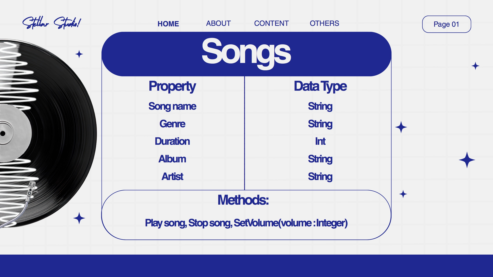

# SG4 - Understanding Classes and Objects
## Class Name
Songs

## Class Description
A song is a short piece of music with words that people sing

## Properties
| Property | Data Type | Description |
|----------|----------|------------|
| Song name | string  | The name of the song |
| Genre    | string   | Genre of the song |
| Duration | int      | How long the song lasts |
| Album    | string   | The album where the song belongs |

## Methods
| Method | Description |
|-———————|-———————————-|
| Play   | Plays the song |
| Stop   | Stops the song |

## Class Diagram

## Design Explanation
### Why did you choose this class?
### Which property is the most important? Why?
### Which method is the most useful? Why?
