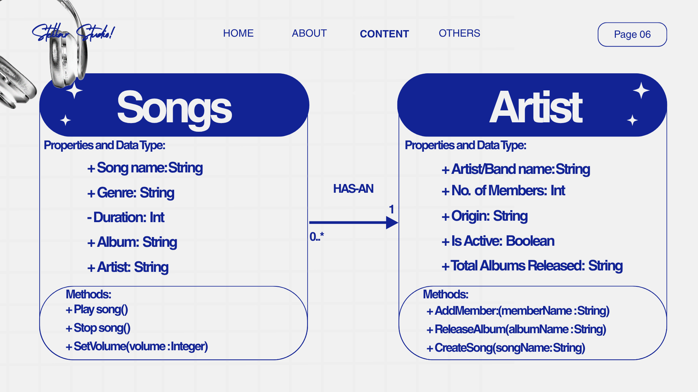
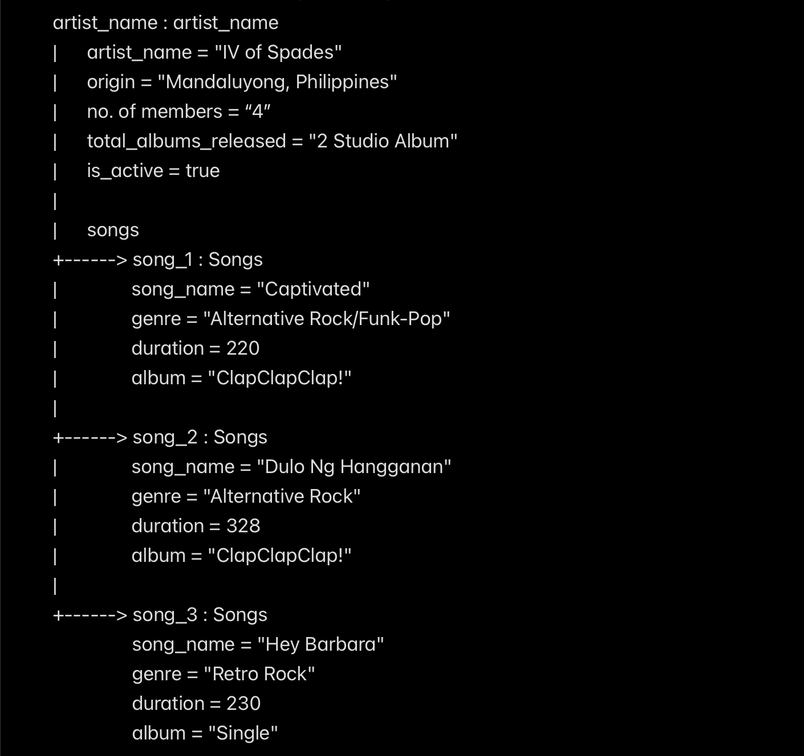

# Class Relationships: Association and Multiplicity

## Previous Work
[Part I - Classes and Objects](classObjectUML.md)

[Part II - Class Attributes and Methods](classAttributesMethods.md)

## Existing Class
Class: Songs

Description: A song is a short piece of music with words that people sing

## New Related Class
Class: Music Artists

Description: Music Artist/s are people/person who created song

## Association
Relationship: Songs HAS-AN Artist

Explanation: Every song has an artist because an artist is responsible for creating, performing, or producing the song. Without an artist, there would be no one to compose or produce the song to exist.

## Multiplicity
Multiplicity: 1..*

Explanation: Songs can have more than one artist, especially when artists collaborate on a song. However, a song can never have lower than one artist.

## UML Class Relationship Diagram

## Python Implementation
[View Python Source](classRelationships.py)

## Test Run

## Object Relationship Diagram

## Analysis
### What is the association between your two classes? 
The association between Songs and Music Artists is that a music artist creates, performs, or produces a song. A song can be connected to one or more artists, especially when multiple artists collaborate on the same song. Therefore, the relationship is Songs HAS-AN Artist.

### What multiplicity did you choose and why? 
I chose a multiplicity of 1..* because every song must have at least one artist. A song can also have multiple artists when there is a collaboration between two or more performers or creators.

### How did you implement the relationship in Python?

### Why did you store an object reference instead of copying its data?
I stored an object reference because it allows the song to directly refer to the existing MusicArtist object. This avoids duplicating the artist's information, such as their name, and keeps the data consistent. If the artist's information.

### If your relationship uses many, why is a list appropriate?
A list is appropriate because a song can have one or more artists, and a list can store multiple MusicArtist objects. It also makes it easy to add or access different artists associated with the song. This represents the 1..* multiplicity of the relationship clearly in Python.
